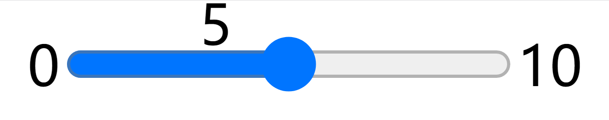

# input-range-element
> 用 [Web Conponent](https://developer.mozilla.org/en-US/docs/Web/Web_Components) 封装一个滑块组件，显示`min`、`max`以及当前值`value`

# Video Tutorial
- https://mianbaoduo.com/o/bread/Ypqbkpxr

# Docs
- https://github.com/mdn/web-components-examples

# More tutorial
- https://mianbaoduo.com/o/bread/mbd-YpmXlZhq